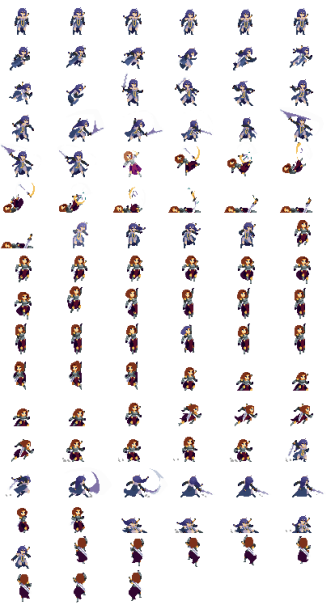

<h1> Game Design Document </h1>

### Table of contents

- [Game Overview](#game-overview)
- [Story and Narrative](#story-and-narrative)
- [Gameplay and Mechanics](#gameplay-and-mechanics)
- [Level and World Design](#level-and-world-design)
- [Art and Audio](#art-and-audio)
- [User Interface(UI)](#user-interface-ui)
- [Technology and Tools](#technology-and-tools)
- [Team Communication, Timelines and Task Assignment](#team-communication-timelines-and-task-assignment)
- [Possible Challenges](#possible-challenges)
- [References](#references)

### Game Overview

**Core Concept:**

Lunala and the Celestial Tower is a hack and slash RPG where players play as Lunala, bounded by a pact with the Moon lord attempting to ascend the Celestial Tower. Within the game, players can utilize a variety of abilities granted to them by Lunala's pact with the moon lord to determine their playstyle all in an attempt to conquer the Celestial Tower and free her people. Players will need to skillfully utilize these abilities and mechanics offered to them and assist Lunala in overcoming each floor of the celestial tower to become stronger and face the notorious Moon Lord.

**Genre**

- As stated previously the game belongs to a variety of Genres and takes elements from each but it draws primarily from the Action RPG, Hack n Slash, and Rouge genre of games. The game contains Action RPG elements such as the detailed story and narrative regarding the game, the variety of abilities that players can select, and the ability to level up the character and improve them. The combat of our game also shares many characteristics with that seen typically in Hack n Slash games where the emphasis is heavily on melee attacks. The elements of the rogue video game genre can be seen in our game via the ideas of runs or simply put when a player fails a level they start over. It can also be possibly seen in the level design and generation

- The game's gameplay and mechanics take inspiration from other games such as Hades and Vampire Survivor and draw from the elements that make these games enjoyable. However, our game is much more fast-paced and places a greater emphasis on skill-based gameplay The game also takes aesthetic and tone inspiration from games such as Hollow Knight which has very eye-catching visuals.

    

Fig 1. Gameplay from Hades https://www.ign.com/games/hades/gameplay

    

 Fig 2. Visual Style of Hollow Knight https://www.youtube.com/watch?v=U8Wz-VwX5dw 

**Target Audience**

The target audience for our game is likely to be individuals that are aged 12+ and this is simply due to the difficulty and violence present in the game which might make it difficult to grasp for a younger audience. The themes, setting, character design, and narrative of the game might also make it unsuitable for a younger audience. The game is suitable for individuals of any background or gender but our game would be ideally suited for players who enjoy fast-paced and challenging gameplay with a large amount of replayability. Players who enjoy games such as Hades would find our game quite enjoyable. The game is also suitable for those with an appreciation of in-depth narratives as we have put in quite a bit of effort in detailing the backstory and motivation of our main character's objectives within the game.

**Unique Selling Points**

- Difficulty - Typically in games players are free to retreat from combat or a viable strategy can be to dodge for some time for players to recollect themselves and avoid a loss. However, in our game, we have decided to be much more punishing as players have to constantly engage with the game as not getting kills drains health which can lead to the end of a run through the celestial tower. As such we introduced a unique risk/reward system if players attempt to avoid fighting for too long or spend a large amount of time dodging they can be in a disadvantaged state when they enter combat again.

- Replayability - Within our game, there are many abilities each with it's own upgrade trees that players can select from which encourages replayability, exploration, and new strategies to be crafted. As such players can play through the game again and attempt to try out a new playstyle by trying different upgrades for Lunala to complete the game in perhaps a more efficient manner or even make it more challenging. As the levels vary between runs it can also offer replayability for players as they can get new experiences when playing again.

- Unique Levels: Within our game, each of the levels can impose some form of an effect on the player and enemies which will allow for unique variations in the gameplay between levels. The combination of enemies will also vary between levels. It will challenge players to adapt their gameplay strategy and their utilization of the mechanics offered.

- Unique aesthetic and theme: The game will consist of a unique aesthetic where we employ a more muted color palette as it complements the lunar theme and narrative of our game.

- Risk and Reward: Unless the player constantly engage in combat, they will not be able to earn enough points to acquire upgrades and without these upgrades player's will greatly struggle in higher floors.

### Story and Narrative

**Backstory**

The backstory that leads to the events of the game has to do with the moon lord's tyrannical rule over Lunala's people. To avoid his wrath, the people of Lunala's home have made it a common practice to create a pact with him for appeasement. While this has granted them powers it comes with consequences and the only true person that benefits from this arrangement is the moon lord. In Lunala's time, the moon lord has begun his goal to create the celestial tower which can have disastrous consequences. The backstory also developed the setting of the game which is the celestial tower a mysterious structure that assists the Moon Lord's goal of domination. The player will have to traverse the many floors of the celestial tower to complete the game. The main conflict of the game as depicted by the backstory is that between Lunala and the Moonlord and her struggle to free her people.

**Characters**

Within the game, there is only one playable character that is Lunala who is our main character as the game follows her quest to free her people by conquering the celestial tower. The main villain or boss of the game is the Moon Lord who is the individual that has harmed Lunala's people. If it is possible we would like to include him as a figure in the game for the players to fight as the final boss.

- Lunala
  - Background: Fearing the might of the Moon Lord, just like her people Lunala has made a pact with the moon lord. However, the creation of the Celestial Tower has led to many illnesses and deaths for her people and has urged her to take action. Wishing to stop this madness, Lunala has taken it upon herself to climb the tower and defeat the Moon Lord to break the pact and free her people. Lunala wields a sword, which is an heirloom from before the time of the Moon Lord. The sword has a unique property that allows it to absorb Celestial energy from monsters and other beings. The more energy it absorbs, the more powerful it becomes and the more ability it gains. Lunala also can harness the energy directly from the sword, so the more enemy she defeats the stronger she becomes.
  - Personality: Lunala is a courageous and determined young woman with a strong sense of responsibility

 

    

 Fig 3. Sketch of Lunala 

- Moon Lord
_ Background: A tyrannical sorcerer who rules over Lunala and her people using his celestial power. As a sorcerer of the moon, the Moon Lord is more fearsome during the night than during the day and he is most powerful during a Blood Moon. However, a Blood Moon is a rare phenomenon and as time goes on his ambitions become greater and so does his desire for power and influence. Thus the Moon Lord commands his servants to build the Celestial Tower which grants him the power to conquer the Sun and create a world of eternal Blood Moon where only he reigns supreme.
_ Personality: The Moon Lord is an evil and ruthless overlord who will do anything to complete his goals
 

    

 Fig 3. Sketches of Moon Lord 

- Enemies:
  - Wizard - Restless sentinels: They are disgraced warriors who once challenged the tower’s trials. These foes are bound to the Moon Lord, ceaselessly guarding the tower’s corridors. Possessing medium health, they are long rage attackers, wielding magic staff's.
  - Reapers - Bringer of Death: They are creatures born from the chaotic energies swirling within the tower’s depth. They often manifest in groups but their low health and lack of coordination make them vulnerable to swift and precise attacks.
  - Moon Lord - Celestial Tyrant: The Moon Lord is a boss enemy, he has a very large health pool with all the abilities that Lunala has. As a sorcerer, the Moon Lord prefers to attack in range whilst avoiding close range combat. To beat the game, the player has to defeat the Moon Lord. If the player fails to defeat the Moon Lord in 2 minutes once in the Moon Alter, the player will automatically lose.

 

    

 Fig 4. Reaper Design  

 

    

 Fig 4. Wizard Design  

### Gameplay and Mechanics

**Perspective**

The perspective of the game will be Top-Down which is a 3rd person camera perspective. The camera will not be able to be moved by the players themselves as we want their focus to be centered on the combat and their immediate environment. Instead, as the player explores the map the camera will follow them due to the character on screen being the focus of the frame. The top down view makes players more invested in the narrative that the game is attempting to capture as it imitates the view that a character such as the Moonlord would have upon a character they have made a pact with. To create the top down view, the camera will be rotated 30 deg on the X axis. The camera will also follow the player character as it moves around.

 

    

 Fig 5. Example of Top Down View 

**Controls**

The controls for the game will be fairly simple so that the players can keep their focus on the skillful use of these controls instead.

- Movement: WASD
- Dodge: Spacebar
- Interact: F
- Attack:
  - Rotate the mouse to choose the direction of attack
  - Left Click: Perform Melee Attack
  - Right Click: Use Lance
- Abilities : Use E and Q to perform abilities
- Upgrades: Use U to open the upgrade menu for abilities

 

    

 Fig 6. Keyboard Controls for the Game  

**Progression**

Players attempt to complete stages that last 1.5 minutes each and eliminate the enemies within the stage. After the first 2 level, the player can choose to challenge the final floor of the celestial tower and face the Moon Lord or to continue playing more stages. If they do not choose to challenge the Moon Lord after the first 2 level, the option will still appear at the end of each level. However, the ideal progression we would like to create is that the player progresses through a set amount of levels to acquire upgrades and become stronger before reaching the top.

To increase the difficulty throughout the game we add modifiers that impact Lunala through each of the levels causing variations in the player's strategy. Additionally, every level the player completes, the next one will have enemies that are stronger with greater health and damage.

For the player to lose the game they have to have their health reduced to 0 before defeating the final floor of the celestial tower. If the player does not beat the final floor the score that will be depicted is the amount of floors they have completed and the time on the floor where they were defeated. However, if they do defeat the final floor the score that will be depicted will be how many floors they faced before completing the game where a lower amount of floors faced is a higher score.

Our game encourages players to keep playing and progressing by appealing to their sense of accomplishment and introducing challenges/difficulties so they feel rewarded when they overcome them.

**Gameplay Mechanics**

Mechanics are fairly simple to ease player understanding and learning and focus more on their skillful utilization of the mechanics. The mechanics or actions that players can take are to utilize melee attacks and the abilities featured in the game.

- Abilities: These are the core mechanics of the game and its combat system. It is also one of the key mechanics that makes the game fun as it is fundamental for having engaging combat. Additionally, it complements the time survival mechanic as well due to the players needing to utilize the abilities they have chosen to be able to survive the levels. The fundamentals of each ability is that they have a short cooldown before they can be used again and players can upgrade abilities any time.

  - Celestial Strike: A ring of celestial energy that deals damage to enemeies that are in it
   

  
  

  
 Fig 7. Visualization of Celestial Strike  

  - Lunar Lance: Unleash a lance made out of pure Celestial energy in a selected direction (Long range projectile)
   

  
  

  
 Fig 8. Visualization of Lunar Lance  

  - Dash: Launches Lunala forward and become invulnerable for the duration of the dash. Dash has a 2 second cooldown before it can be used again

  - Moonlight Blessing: Summons a moon over the player's head that continuously heals them for 10 seconds.
  

  
  

  
 Fig 9. Visualization of Angel of Death  

- Points Mechanic (In-Game Economy): Celestial energy can be found inside Moon Shards which are dropped by enemies when they are killed. These moon shards can be used by the player to purchase different upgrades.
 

    

 Fig 10. Example of Moon Shard from https://en.ac-illust.com/clip-art/23499459/pixel-art-crystal  

- Health System: If the player is hit my enemies they lose health and if the health bar reaches 0 that is game over. However, the player can be healed using Moonlight Blessing and the healing can be further improved via upgrades.

- Upgrade System: Points can be used to purchase different upgrades. The player can press U to open the upgrade menu which will allow the player to select which upgrade they wish to purchase and each ability has its own skill tree. Upgrades can help increase attack damage, increase attack range and provide new effects. E.g. a level 1 lunar lance only launches 1 lance but a level 3 may launch 3 lances instead.

### Level and World Design

**Game World**

The game is going to be a pixel game and it will be captured on screen in 2.5D. The game will consist of multiple levels which are derived from phases of the moon. Each level will impose unique effects on Lunala and the enemies and will last 2.5 minutes. The player can defeat the boss within 5 minutes. The game world does not contain a map or minimap as players can simply navigate the levels by moving through them to find new areas. Therefore the game world scrolls along with the player rather than being a single screen.

    

 Fig 12. Tutorial Floor Design  

    

 Fig 11. Floor 1 Design   

    

 Fig 13. Floor 2 Design  

    

 Fig 13. Boss Floor Design  

- Level Design : The game has 4 unique levels that serves different purposes. Each level has a gate where the player can enter to progress to the next level. However, the circumstances in which the gate appears varies. Everytime the player enters a new level, unique modifiers and enemy spawns will be assigned to that level.

  - Floor 0: This would act as a tutorial level which occurs at the base of the celestial tower. The player controls Lunala and is introduced to basic movement controls, abilities and, an upgrade system. The level serves as a tutorial to teach players basic gameplay and mechanics.

  After the tutorial, Floor 1 and 2 will alternate everytime one is completed

  - Floor 1: Long large room with a lot of windows, light and contains a lot of foliage. This level has a gate located in the far right.

  - Floor 2: Two interconnected rooms with narrow hallway, dim lighting and contains water ponds. This level has a gate located in the bottom right of map.

  - Final Floor: This would be the boss fight of the game where players have to face the Moon Lord. The effects on Lunala on this floor would change after a set amount of time such as every 30 seconds. The Moon Lord would ideally have a variety of abilities, high HP, large damage range and, high damage. To make the level dynamic sections of the map may collapse to shrink the playable area.

**Objects**

- Enemies: The enemies are one of the main objects in each of the levels featured in the game world. Their role is to deter the player's progress and they interact with the player by actively seeking to damage them by attacking. However, they have no interaction with each other

  - Possible Enemies
    - Wizard: An enemy with long range attacks, mediocre amount of damage, slow movement
    - Reapers: An enemy with close range attacks, low damage, mediocre movement speed, high spawn rate
    - Moon Lord: Boss enemy with both long range and close range attacks, high health
  - The player will also find that certain abilities prove more useful for certain enemies such as celestial strike for Reapers or lunar lance for enemies with high range

- Projectiles: Those shot by range abilities are intended to damage sprites. When created by the enemies and when they collide with the player they will damage them and vice versa. Two projectiles cannot interact with each other

**Physics**

- When an enemy is slain, Moon shards are dropped on the ground with a hovering animation and when the player walks near them, they are picked up
- All characters and static objects are based on the ground.
- Projectiles shoot out in front of the characters and hover from the ground. There is an explosion effect when projectiles hit the character and a hit effect with melee attacks.
- All objects move at a constant speed and do not bounce when hitting the wall.
- All the enemies have a collider which prevents them from clipping through each other, however Lunala can clip through the enemies.

### Art and Audio

**Art Style**

The game will have a dark fantasy 2.5D pixel art graphics. The general style will consist of dark and muted colour palette with immersive lighting where illuminated areas will stand out, enhancing the atmosphere (Similar to Hollow Knight).

    

 Fig 14. Hollow Knight Art Style from https://www.polygon.com/guides/2018/7/20/17581234/hollow-knight-beginners-guide-map-pins-quill-charms-rancid-egg-switch   

    

 Fig 15. Art Style Inspiration from https://cdn.sortiraparis.com/images/80/66131/932087-blasphemous-2-plongez-dans-l-horreur-des-le-mois-d-aout-2023.jpg   

As the location of the game is the Celestial tower, a suitable art style for the environment would consist of gothic ornaments, statues and, a lot of tiles with an eerie atmosphere.

Inspiration for environment:

 

    

 Fig 16. Environment Inspiration from https://www.artstation.com/artwork/OdKJ8     

 

    

 Fig 17. Environment Inspiration from https://www.deviantart.com/3d1viner/art/Full-Moon-Tower-2-AI-art-948701724    

 

    

 Fig 18. Environment Inspiration from peakpx.com/en/hd-wallpaper-desktop-agzhc  

The character will be a 2D sprite in a 3D envionrment with a gothic and medieval style

    

 Fig 19. Possible Character Inspiration from https://assetstore.unity.com/packages/2d/characters/warrior-free-asset-195707 

Typeface:

    

 Fig 20. Game Text Style from https://www.fontspace.com/ancient-modern-tales-font-f28700 

**Audio**

Music and audio is a mix of mellow and intense to capture the challenging combat that players will face but also the serene connotations associated with the concept of moons

- Combat Music :
  - [Enkanomiya Battle Music - Genshin Impact OST](https://www.youtube.com/watch?v=kHYqbJPLcG0)
  - [Ender Lilies OST - Guardian Siegrid (Both Phases) Extended](https://www.youtube.com/watch?v=poc-oC1sOaw)
- Main Menu / Out of Combat Music:
  - [Hollow Knight OST [Epic and Exciting Soundtrack]](https://www.youtube.com/watch?v=tOLuTYVJ7DA)
  - [Ori and the Blind Forest Sountract(Full)](https://www.youtube.com/watch?v=MeVFrt7BUyw)
  - [Vampire Dark Romance Piano | Dark Academia Music with Rain | Melancholic Relaxing Ambience](https://www.youtube.com/watch?v=68PIATQsEMw)
- Sound Effects:
  - https://assetstore.unity.com/packages/audio/sound-fx/rpg-essentials-sound-effects-free-227708
  - https://assetstore.unity.com/packages/audio/sound-fx/foley/footsteps-essentials-189879

**Assets**

The Unity asset store will be the primary source for assets to be used within the game

- Animated Pixel Icons : https://www.behance.net/gallery/69496445/Animated-Pixel-Icons

- Logo Design:

    

 Fig 21. Logo of Game 

- Lunala Asset:

    

 Fig 22. Lunala Sprite 

    

 Fig 22. Lunala Sprite Animation

### User Interface (UI)

- Main Menu : Due to the darkness of the environments and menus, many of the UI elements will be white. We will take inspiration from games such as Hollow Knight and Ender Lilies

    

 Fig 23. Hollow Knight Menu from https://www.youtube.com/watch?v=ppGaFJ0CY64 

    

 Fig 24. Ender Lilies Menu 

    

 Fig 25. Our Game Menu 

- Gameplay UI : The Gameplay UI is kept very simple but provides ease of understanding to the player by only focusing on the necessary elements that the player needs to be concerned with. The simplicity of the UI allows the players to be mainly immersed in the combat of the game which is relevant as the difficulty and challenge of our game is what makes it appealing. In terms of aesthetics, it is also a good reflection of the concept of the moon which is one of the core elements of our game.
  - Health Bar:
  

  
  

  
 Fig 26. Health Bar Options

  - Skills :
  

  
  

  
 Fig 27. Player SKills UI 

  - Gameplay HUD:
  

  
  

  
 Fig 28. Gameplay HUD 

  - Upgrade Menu:
  

  
  

  
 Fig 29. Upgrade UI 

### Technology and Tools

- Unity
- GitHub
- Paint Tool Sai
  - Sketching Ideas such as character design, ui design, logo, concept art etc
- Photoshop
  - Creating basic pixel art and altering existing images
- Adobe Illustrator
  - Retracing logo and icons design from pixel to vector
- Blender
  - Building blockouts for level and environment design

### Team Communication, Timelines and Task Assignment

- Discord : The majority of team discussions will be communicated via discord. It will be our primary channel of communication to facilitate in-person meetings or for team members to raise concerns or provide possible suggestions for improvements.

- Trello: Trello will be utilized to keep track of assignments that need to be completed and the overall timeline regarding our project. It will also be the avenue through which different team members are assigned tasks. \* [Cube Masters Trello Board](https://trello.com/invite/graphicandinteraction/ATTI234a653edb72a00bb30082a2566a28ec973F9C1D)

    
    

    
 Fig 30. Divison of Taks for Milestone 2 Project 1

    
    

    
 Fig 31. Initial Divison of Taks for Milestone 3 Project 1 

    
    

    
 Fig 31. Initial Divison of Taks for Milestone 1 Project 2 

    
    

    
 Fig 32. Weekly Meeting Record 

### Possible Challenges

The primary challenge that our team will face is regarding the scope of our project. Currently, we may possess a very optimistic view of the game which may pose challenges further down during development when we attempt to implement this as much of our team does not have familiarity with Unity. As such our team is going to spend some time utilizing tutorials and practicing the necessary skills to utilize in our game development. We are also going to ensure that we are participating in the tutorials throughout the semester to acquire the necessary knowledge to succeed

The timeframe we have to develop this game can also be a possible challenge for our team. We have quite a large scope for our game and with the hectic schedule that all team members face it may be a difficult task to develop our vision fully by the deadline. As such a necessary solution may be to develop some sort of schedule or timeframe for deliverables for the game. This ensures that team members are actively aware of when their specific components need to be completed and helps keep team members accountable for their progress

The coding style and team coding will prove to be a challenge for us. We believe it will be quite difficult to evaluate or interpret another team members code due to each individual having their own unique coding style. As such to ensure that all team members are able to understand the code within the scripts that are being created we will strive to employ good coding practices going forward. This will include the use of good variables names, spacing and commenting.

The interaction between the enemies and players will prove to be a challenge as it is a fundamental element of our game. It will be quite difficult to develop the interactions as there are many components with the various abilities, upgrades and types of enemies. As such to ensure there are no challenges we will ensure that we have an adequate amount of team members focusing on the characters while also ensuring that we have some sort of timeline to ensure tasks related to them are completed.

Shaders will prove to be a significant challenge for us in the process of developing the game. This challenge arises due to all of our team being unfamiliar with the process of developing shaders and from the timeframe in which they need to be developed. To ensure that this challenge is met we we will ensure that our team spends an adequate amount of time practicing and utilizing both the in-class tutorials and online tutorials to help assist us in our development.

### References

    * Sound effect files extracted directly from Trickster Online
    * [Effect Assets](https://sangoro.itch.io/vfx-starter-pack)
    * [Cartoon Effects](https://assetstore.unity.com/packages/vfx/particles/cartoon-fx-remaster-free-109565)
    * [Crafting Materials](https://beast-pixels.itch.io/crafting-materials?download)
    * [Skybox](https://assetstore.unity.com/packages/vfx/shaders/free-skybox-extended-shader-107400)
    * [Bringer of Death ](https://assetstore.unity.com/packages/2d/characters/bringer-of-death-free-195719)
    * [Pixel Game Assets](https://assetstore.unity.com/packages/2d/characters/pixel-adventure-1-155360)
    * [Magic Effects](https://assetstore.unity.com/packages/vfx/particles/spells/magic-effects-free-247933)
    * [Warrior Sprite](https://assetstore.unity.com/packages/2d/characters/warrior-free-asset-195707)
    * [Holy Spell Effect](https://pimen.itch.io/holy-spell-effect/download/eyJleHBpcmVzIjoxNjkzNzA0ODYzLCJpZCI6MTI5MzM1MH0%3d.PaJgtPdJwPAOZbm9ZAI4baKd2%2f4%3d)
    * [Enkanomiya Battle Music ](https://www.youtube.com/watch?v=kHYqbJPLcG0)
    * [Hit Spark ](https://pimen.itch.io/battle-vfx-hit-spark)
    * [Level Design Assets](https://assetstore.unity.com/packages/2d/environments/rogue-fantasy-castle-164725)
    * [Main Menu Background](https://www.facebook.com/logalpix/photos/a.2189418507997420/2550912275181373/?type=3)
    * [UI Soundpack](https://assetstore.unity.com/packages/audio/sound-fx/ui-casual-soundpack-150430)
    * [Wizard Enemy](https://luizmelo.itch.io/evil-wizard-2)
    * [Death Sound](https://pixabay.com/sound-effects/search/game-over/)
    * [Water Shader tutorial](https://catlikecoding.com/unity/tutorials/flow/looking-through-water/)
    * [Level 3 Statue](https://sketchfab.com/3d-models/gaurdian-statue-f2656927d6994722bd5a84d364928eb2)
    * [Level 3 Textures]( https://regamer.itch.io/free-pack-pixel-art-texture)
    * [Level 3 Bricks](https://hail-satan.itch.io/3d-pixel-art-game-assets)
