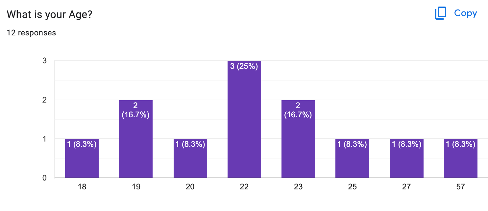
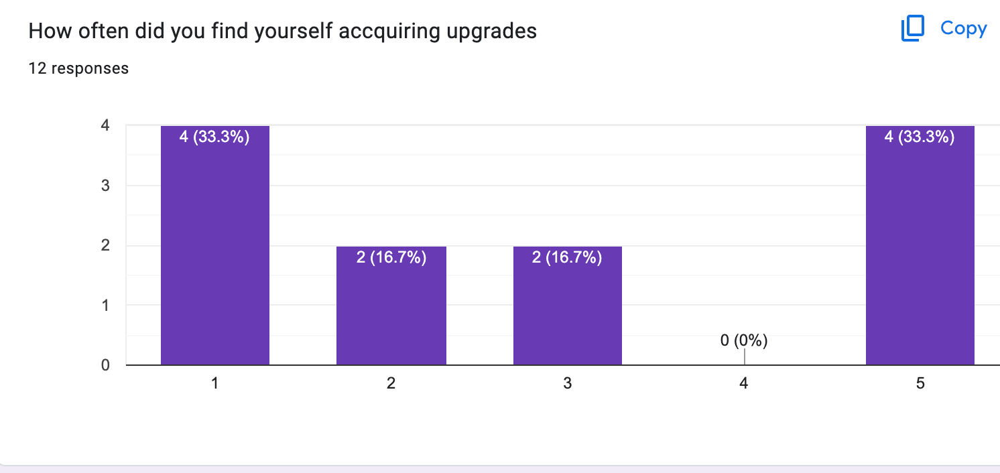

# Game Report

## Table of Contents

- [Evaluation Plan](#evaluation-plan)
- [Evaluation Report](#evaluation-report)
- [Shaders and Special Effects](#shaders-and-special-effects)
- [Summary of Contributions](#summary-of-contributions)
- [References and External Resources](#references-and-external-resources)

## Evaluation Plan

### Evalutation Techniques

- Techniques:

  - Observation Technique(**Post-task Walkthroughs**): The Post-Task Walkthrough would be the most appropriate observation technique that is suited for our particular game. Due to the fast paced gameplay within our game that results from the difficulty of the game the other techniques would not be suitable to utilize. Using Post-task walkthrough ensures that we avoid any unecessary interruptions to the participants which is necessary as we want the participant to remain immersed. Additionally other methods for observation such as Think Aloud and Cooperative evaluation would simply not work with our game as due to the pacing it would be quite challenging for a participant to take time to explain their thinking or even answer questions that we pose to them(Samundeeshwaran, 2022). It also avoids the possible awkwardness that a participant may feel by having to narrate their thoughts which could remove them from the experience the game is attempting to create

  - Querying Technique(**Questionnaires**): Providing fixed questions to users is a more suitable approach for our querying technique as it is less time consuming compared to an interview. Additionally it allows us to gather a large amount of participant easily by simply sharing a link to the questionnaire which provides us with a varying set of perspectives that can prove useful when evaluating our game(Samundeeshwaran, 2022). However depending on the questions that we administer as part of our Questionnaires we run the potenital risk of receiving very surface level answers from our participants. As such we will ensure that we mainly utilize open-ended questions to allow pariticpants to answer in depth but also utilize scalar or multi choice questions to accquire approprirate qualitative data

- Tasks: The primary task that we will ask our participants to perform will be to play through the first level of our game Lunala and the Celestial Tower. This is an ideal task to make participants perform as it provide them with the tutorial to the game and educates them on the primary mechanics that are required. By asking them to play the first level of the game through to completion they are able to experience the majority of the elements of the game such as the abilities, upgrade and enemies. The primary reason that we have one task instead of multiple smaller tasks is that the primary appeal of our game is the combat and so with the task of simply attempting to beat the first level we accquire valuable feedback on the core elements of the game such as difficulty and enemy-player interaction. Additionally it is useful when we attempt to utilize the Post-task walkthrough method for observation as we avoid the risk of the pariticpant forgetting critical information as their focus is on one task.

### Participants

- Recruiting Participants: The primary plan to recruit participants is to gather from the friends and family members of the team. This is an ideal plan as these participants are easily accessible and easy to contact. It is also easy to use either the observation or querying technique on them due to them being readily available. However, simply gathering participants who have close relations with members of the team may have risks as they may be less inclined to provide critical feedback and their feedback may be biased. As such an additional plan to recruit participants is to utilize channels such as the University of Melbourne Reddit which will allow us to gather a wide range of participants who are likely to be more critical of the game.

- Qualifying Criteria: To ensure that the participants that we are recruiting fall within our target audience we will utilize a questionnaire that allows us to determine the background of the participants. As we stated within the GDD, our target audience is individuals over the age of 12 and those who enjoy games whose selling point is the challenge and fast-paced gameplay. It is crucial that we identify participants that fall within our target audience as their feedback would carry more weight and our goal is to make the game engaging for them. Within the questionnaire, it is likely that we will have questions to identify their background and others to determine what kind of games they typically play or the aspects of games they find enjoyable.

### Data Collection

- Collecting Data: Within our evaluation, we will aim to collect a mix of qualitative data and quantitative data to provide ourselves with a more well-rounded set of feedback that we can utilize to make appropriate changes

  - Qualitative Data: Collecting qualitative data is important as it provides us with more detailed insight into the issues of our games while also complementing the qualitative data we collect. It is also useful to well capture participant's feedback and perspectives in a detailed manner. There is a variety of qualitative data we can collect utilizing open-ended questions such as:
    - What was your first impression of the game?
    - What aspects of the game did you find particularly frustrating?
    - What aspects of the game did you find satisfying?
    - What was your strategy for winning?
    - How did you find the controls?
    - What elements of the game appealed to you?
  - Quantitative Data: Collecting quantitative data allows us to explore and determine if there are any patterns or trends that are recurring within our evaluations. It is essential to provide us with actionable data that allows us to make informed decisions regarding changes that need to be made within the game. Examples of possible quantitative data can be:
    - Level of Difficulty on a scale from 1 to 10
    - Time survived
    - Number of Upgrades Acquired
    - Number of players that would play again
    - Which of the 3 abilities did you use the most? Did you not use abilities at all?

- Data Collection Methods: In order to collect the data we will use observational notes, directed questions to the participants, a questionnaire, and gameplay recording. These methods in combination will allow us to collect a range of qualitative and observational data.

- Data Collection Tools:
  - Nvidia Game Capture: We will use Nvidia Game Capture to record the gameplay of participants when utilizing Post talk walkthroughs
  - Google Forms: We will Google Forms to create the questionnaires required for the game evaluation
  - Pen and paper: Pen and paper will be a useful tool to make quick observation notes regarding the behavior of participants who are being evaluated via our observation techniques

### Data Analysis

- Analysis Methods:

  - Quantitative Data: In order to analyze the quantitative data we can develop a hypothesis by taking an initial look at the results from the evaluation. We can then move on to creating graphs that help visualize the results of the evaluation and easily identify any trends. This will help provide us with a factual basis for any changes that we deem necessary to make.
  - Qualitative Data: In order to analyze the qualitative data we collect the responses from each participant and compare them in order to identify common trends that are present in each individual's response. We can use these findings to develop grounded theories or claims that are supported by evidence in order to make decisions regarding necessary changes. It is important for this analysis that we have multiple individuals attempt to interpret the responses provided by the participants as it ensures that there is a clear consensus regarding the interpretation of the results.

- Metrics: There are some important metrics that we can utilize in our analysis to help us make informed decisions. Examples of metrics we aim to consider are:

  - Average Difficulty Level: By looking at the feedback acquired we can conclude the difficulty level of the current iteration of the game. This metric proves useful as it informs us on whether we need to make adequate changes to the difficulty of the game so that it becomes more enjoyable for the target audience
  - Average Survival Time: The average survival time acts as a similar metric to the Average Difficulty Level as it indicates whether a level in our game is currently too easy to complete or whether players are really struggling
  - Player retention: Player retention is an important metric to consider as it indicates whether players find our game engaging as the goal is to create a game that players find enjoyable. A low score on this metric would prompt us to perform a very detailed review of the feedback acquired from the participants of the evaluation specifically sections such as What the participant finds frustrating.
  - Ability Usage Rate: As the abilities are one of the core mechanics of our game we want to ensure they are being well used and we want to avoid one ability being used more than another as this limits our gameplay. As such when using this metric if it reveals that one ability is being used more than another or an ability is not being utilized at all, it makes us aware that we have to make changes to the ability.

### Timeline

- Evaluation will be performed around Week 12 once we have a more polished version of the game so that our focus after the evaluation is on how to improve it.
- Changes to the game will be made over SWOTVAC and the week after to ensure we have adequate time to make changes in the event there are significant changes that need to be made.

### Responsibilities

- It is ideal that the responsibilities are equally divided among group members as it increases the likelihood of conducting a high-quality evaluation. Tasks such as recruiting participants are ideal to be divided among all the group members as having more participants ensures that we are able to receive ample feedback. Similarly creating the questionnaire and the questions to be asked during the evaluation should be the task of all members as it ensures that we are covering a wide range of areas of possible feedback. It will be the expectation that each member also contributes to analyzing the results, writing up the report, and developing any required changes as it ensures that the process will be completed in a timely manner. To ensure accountability we will have progress checks or milestones in place to ensure that group members are completing tasks on schedule. Communication and updates will also be an expectation of members as it ensures that the evaluation process is being carried out efficiently

## Evaluation Report

### Evaluation Process

- Questionnaires:
  We utilized the questionnaire as detailed within our plan to perform our evaluation. We shared the link to the questionnaire we developed on [Google Forms](https://docs.google.com/forms/d/1DcRAYNYEhLeipmTeKZ2cLEfMBjS7ezAZH8aJI5A6tpA/edit#response=ACYDBNgB5qXuNPQhi7A7v2nlVd1vRDn4Akfc2r9zNteabUVoFbPjfGBE1v0QcDkYsZZuHhs) on the Unimelb subreddit which allowed us to gather responses from a wide number of members of our demographic. We managed to receive responses from individuals of varying ages, genders, and varying game backgrounds. As stated in our evaluation plan this was an ideal approach as we can acquire unbiased feedback and utilize various perspectives. To ensure that we got meaningful feedback from those taking our questionnaire we used a mix of quantitative questions such as Level of Difficulty from a scale of 1 to 5 and qualitative questions such as frustrating aspects of the game which allows the responder to expand upon their answer.

 

    
 

  

    
 

 

    
 

- Post talk Walkthrough:
  We carried our post-talk walkthrough very similarly to what was detailed in our plan. We explained the task to our tester which was to simply play through as many of the levels that they wished but we gave them a time limit of about 5 minutes. During the playtesting, we took a step back and simply observed and made notes of issues and tendencies that the playtesters faced. A conscientious effort was also made to ensure that we did not answer questions asked by the tester during their playthrough as we did not want to influence their playthrough and wanted to see if they could solve any challenges faced without our input. After the tester's playthrough, we asked our questions and asked them to expand on specific parts of their playthrough. During this time we also allowed our testers to ask us any questions as this allowed us to determine what areas of the game were unclear to our audience. Our demographic for our post-talk walkthrough was not as diverse as for our questionnaire as we made use of close friends. However, we still had a mix of individuals who enjoy different types of games and even individuals that do not play games that often.

### Results of Evaluation

The results of our questionnaire and the notes taken during our post-task walkthrough can be found within our [evaluation](evaluation)folder but we believed it necessary to emphasize some of the key results of our evaluation.

Our game difficulty is one of the key pieces of information we acquired from the evaluation. From our questionnaire, we determined that the large majority of our game was quite easy with most people believing that our game difficulty is only 1/5. Additionally, when asked about the amount of time that the testers were surviving we determined that most of them were easily surviving for the full five minutes which made us believe that our game was too easy. Some individuals did find the game quite challenging immediately such as Liz who was one of our testers for our post-task walkthrough and believed that "the difficulty is not friendly for those who have no experience in gaming". However, most of the testers who felt that the difficulty was too great were individuals who played games casually or rarely so we had to weigh their feedback carefully as our target audience for our game was individuals who enjoyed challenging and fast-paced games.

 

    
 

  

    
 

The evaluation also revealed an issue with our tester's use of our abilities. When observing our playtesters during our post-task walkthrough method we observed that quite often we either had players who would upgrade their abilities frequently or we had players who would rarely upgrade. This was further supported by the results of our questionnaire where we asked the question "How often did you find yourself acquiring upgrades?" to our testers and showed us a similar divide. This revelation had us reconsidering how we can encourage players to upgrade constantly throughout the game as we believed this to be an important aspect of our game. Additionally, our evaluation also led to another issue which is that the large majority of our players were simply utilizing one ability. From the results of our questionnaire, we found that most players were simply utilizing the Lunar Lance ability. Our discussions with our playtesters from our post-task walkthrough also revealed that quite often players were more focused on one ability. For example, when asking James, one of our post-task walkthrough playtesters he shared that his strategy was "dashing and utilizing the projectile attacks". This was critical feedback as we wanted to ensure that our players were utilizing all the abilities we featured within our game as it would enhance their overall experience. We also discovered a trend that the majority of our players were avoiding our melee attack which was a fundamental aspect of our game as they did not enjoy that they had "to stop and swing". Players felt that "the damage of our melee attack is too low and not very useful when surrounded by many enemies".

    
 

    
 

We wished for our players to craft strategies to beat our game by utilizing our upgrades and the various abilities however our evaluation revealed that quite often players were not creating any sort of strategy. We had a large number of players who believed that the game was straightforward enough that a strategy was not necessary while others who because of the sheer amount of enemies were not able to craft strategies successfully. As such this led us to reevaluate our upgrade system and particularly the number of upgrades as we believed that it was within this area where improvements could lead to our playtesters being more thoughtful.

Our controls and our UI were elements of our game that we wished to receive feedback on through our evaluation. Our evaluation revealed that most of our players found our controls easy to grasp and that our tutorial was very helpful in helping them quickly gain an understanding of the tutorials. However, there were aspects that could be considered for improvement. In both our post-task walkthrough and our questionnaire we received feedback that our players wished that there was another method to close our upgrades menu as they felt weird using the key U to close the menu. Additionally, players did not enjoy using 1 and 2 for the abilities as they felt they had to take their hands off the movement keys. An issue with the UI that our players found was the lack of the ability to view cooldowns which was essential given that our abilities are a major component of our game.

Within our evaluation, we inquired what aspects of our game players found particularly frustrating as we wanted to ensure they had a smooth play experience. This revealed a few key aspects of our game that we may need to alter to make it more enjoyable for players. Players found that 5 minutes per level was too long and that nothing exciting happened after a while which we agreed with and so we strived to change this. A common frustration among testers was also the number of enemies that could exist on the level at once. Players found that when there were too many enemies attacking the player the game became quite frustrating. The lack of indication of damage being dealt was another aspect that players found frustrating.

Our evaluation also revealed that our game had many positive aspects that players enjoyed. Players overall had a great first impression of our game and felt it was easy to grasp. They felt that the game was fun and satisfying and that the visuals were well done. The sound design was an aspect of our game that players enjoyed as well. Players enjoyed the many abilities we had and felt that they added to the fun nature of the game. The evaluation also revealed that our game did not have an overwhelming amount of bugs and that were only minor issues such as transitioning to other levels or animation issues. Overall our evaluation also revealed that many of our testers would play our game again if we made the appropriate improvement which was very encouraging.

    
 

### Improvements Made

After the evaluation, the first improvement we made was to add skill icons in the HUD. We added this as many players sometimes don’t know whey their abilities are how they tend to forget what the buttons are causes them to stop using the abilities.This featur helps the player keep track of their ability cooldoowns and the buttons needed to activate them.

    
 

One of our feedback is that even though there is variety in the abilities, they all do practically the same thing which is to deal damage. We agreed that this makes the abilities all blend and all their upgrades will be practically identical. Additionally, not a lot of decision-making is needed during gameplay as the player can just spam all the abilities once they’re off cooldown. Initially, we had our “Moonlight Barrage” ability as an AOE that targets an enemy within its range and deals damage for 10 seconds. We completely changed how it works by making it a healing ability and called it “Moonlight Blessing”, the AOE effect it had is now turned into an upgrade with the same name. With this ability added, we also remove one of our core mechanics of players constantly losing health and gaining health by killing enemies. This helps add more value to their decision-making as the player have to decide whether they want to upgrade their attack abilities or their buffing abilities.

When playing the game, many players found that a simple strategy of running around in circles and using Lunar Lance (projectile ability) is the most effective way to beat the game as they feel that when using the basic melee attack, they feel helpless. To help remedy this, we made it so that the melee attacks are more viable by increasing their damage to 10 and adding damage points when you hit the enemy so that the player can visualize their attack's effectiveness. We also found out that a reason that may contribute to players avoiding using melee is because the melee hit box was not placed correctly when Lunala is flipped, we solved this problem by adjusting its position for each flip so now melee attacks should be more consistent. Furthermore, to make the running around strategy less prominent, we added more upgrades to other abilities to make them more effective and lowered the damage of the lance from 10 to 5. Additionally, we also added a range enemy that attacks players from far away and they don’t group up and chase the player thus making Lunar Lance less effective against them.

- Hitbox Before:

   

- Hitbox After:

    
 

Many players who have experience with playing video games find that the game is relatively on the easy side even though our goal was to make the game challenging. To improve upon this we lowered the timer for each stage from 5 minutes to 90 seconds and made the game endless. However, the player can be the game by challenging the boss level after they complete the first 2 levels. The addition of the range enemy also helps increase the difficulty as now instead of just running around kiting the enemy, the player now has to avoid multiple projectiles that are being shot at them. Furthermore, every time the player moves onto another floor, both the enemy’s health and damage become stronger which allows the difficulty to increase linearly with Lunalar, assuming the players are upgrading their abilities. Lastly, we added modifiers that change with each floor to make the game less repetitive, and depending on the modifier the difficulty of the floor changes as well so the player needs to be prepared for the challenges.

In the tutorial section, we adjusted the location of hint boxes based on player feedback and added more of them to make sure that the player got the general information they needed such as what each abilities do and what their goals were. Additionally, we also granted the player 200 points at the start of the game so that they could try out the upgrade system. Lastly, we implemented a dialogue system into the game so that the player can understand the basic narrative and provide a greater understanding of why they’re playing the game and what it’s about. Without disrupting the gameplay, the dialogue only appears at the start of the game and when the player reaches the boss level.

    
 

## Shaders and Special Effects

There are two custom shaders applied to improve the visual effect of the game, water and grass shader. The water shader has simulated the features of water material including refraction, wave simulation and transparency. The grass shader explores the illusion of a dynamic grass field and simulates the movement of grass blades in the wind.
To simulate the realistic wave or wind effect, a noise texture is sampled to create the randomness of the waves based on the world position of the vertex. By knowing the noise value, we use it to create a wave value by taking the oscillation function and adding it to the vertex position. In water shader, the depth is achieved by knowing the distance between each vertex to the main camera. It can be used as a gradient to create the foam line. To make the underwater more realistic, the distorted sample is applied at the end of the fragment shader to mimic the refraction effect. Unlike the water effect, the animation of grass is achieved with gradient texture instead of noise texture.

- Water: [Path](Assets/Shaders/water.shader) and [Script](Assets/Script/Shader/CameraFetch.cs)

    
 

- Grass: [Path](Assets/Shaders/Grass.shader)

 

    
 

We created a custom particle system for our ability “Blessing of the Moon”, the ability is used to heal the character. The particle can be seen behind the Moon sprite that appears above Lunala, we created the particle to act as a way to showcase the Moon’s celestial energy and also to make the sprite more interesting to look at and not so static.

The particle system is heavily inspired by fire particles. The particle system’s shape is a cone but we altered its radius and scale so that it becomes a cylinder instead so that the particles emits in roughly the same way.

The particle system is created using a basic billboard with a simple circular particle sprite, however both the minimum and maximum particle is set to 0 so it doesn’t appear. The “particle” that is shown is actually the trail each particle leaves behind. The trail has a width over trail of 0.06 to fit behind the moon sprite.

The particle system also uses a downward curve for its size overtime so that the as time goes on, the particle becomes thinner giving it the effect that it’s fading as it rises like how a fire would.

    
 

To further add to this fade effect, we also added a color over time where its a blue to white gradient, the blue color is to represent the color of celestial energy

    
 

To add variety to the colors and give a more of a “fire” feel where the inner layers are lighter and the outer layers are darker. To accomplish this, we duplicated the particle system, lightened the color and scaled it down and placed it in the middle of the other particle system.

Location of Particle Effects: Assets/Prefab/Abilities/Angel of Death/Angel of Death (Prefab Asset)/ can be found in the particles section of the hierarchy (Particle System and Particle System (1))

    
 

 

    
 

## Summary of Contributions

Our team divided the taks that needed to be completed so that we have a finished product. Yiran worked on our level design and our shaders. Thaya focused on our main character and our UI. Rohit focused on the development of our enemie and our evaluation.

## References and External Resources

- Game Resources:

  - Sound effect files extracted directly from Trickster Online
  - [Effect Assets](https://sangoro.itch.io/vfx-starter-pack)
  - [Cartoon Effects](https://assetstore.unity.com/packages/vfx/particles/cartoon-fx-remaster-free-109565)
  - [Crafting Materials](https://beast-pixels.itch.io/crafting-materials?download)
  - [Skybox](https://assetstore.unity.com/packages/vfx/shaders/free-skybox-extended-shader-107400)
  - [Bringer of Death ](https://assetstore.unity.com/packages/2d/characters/bringer-of-death-free-195719)
  - [Pixel Game Assets](https://assetstore.unity.com/packages/2d/characters/pixel-adventure-1-155360)
  - [Magic Effects](https://assetstore.unity.com/packages/vfx/particles/spells/magic-effects-free-247933)
  - [Warrior Sprite](https://assetstore.unity.com/packages/2d/characters/warrior-free-asset-195707)
  - [Holy Spell Effect](https://pimen.itch.io/holy-spell-effect/download/eyJleHBpcmVzIjoxNjkzNzA0ODYzLCJpZCI6MTI5MzM1MH0%3d.PaJgtPdJwPAOZbm9ZAI4baKd2%2f4%3d)
  - [Enkanomiya Battle Music ](https://www.youtube.com/watch?v=kHYqbJPLcG0)
  - [Hit Spark ](https://pimen.itch.io/battle-vfx-hit-spark)
  - [Level Design Assets](https://assetstore.unity.com/packages/2d/environments/rogue-fantasy-castle-164725)
  - [Main Menu Background](https://www.facebook.com/logalpix/photos/a.2189418507997420/2550912275181373/?type=3)
  - [UI Soundpack](https://assetstore.unity.com/packages/audio/sound-fx/ui-casual-soundpack-150430)
  - [Wizard Enemy](https://luizmelo.itch.io/evil-wizard-2)
  - [Death Sound](https://pixabay.com/sound-effects/search/game-over/)
  - [Water Shader tutorial](https://catlikecoding.com/unity/tutorials/flow/looking-through-water/)
  - [Level 3 Statue](https://sketchfab.com/3d-models/gaurdian-statue-f2656927d6994722bd5a84d364928eb2)
  - [Level 3 Textures](https://regamer.itch.io/free-pack-pixel-art-texture)
  - [Level 3 Bricks](https://hail-satan.itch.io/3d-pixel-art-game-assets)

- Report Reference:

  - Samundeeshwaran, R. (2022, April 16th). _Evaluation techniques for interactive systems_. Medium. https://medium.com/@radhushani111/evaluation-techniques-for-interactive-systems-d3946593ca9a

- Gameplay Video Resources:
  - [Typewriter Sound Effect](https://www.youtube.com/watch?v=jdIE3IBay7I)
  - [Logo](https://app.logo.com/editor/colors)
